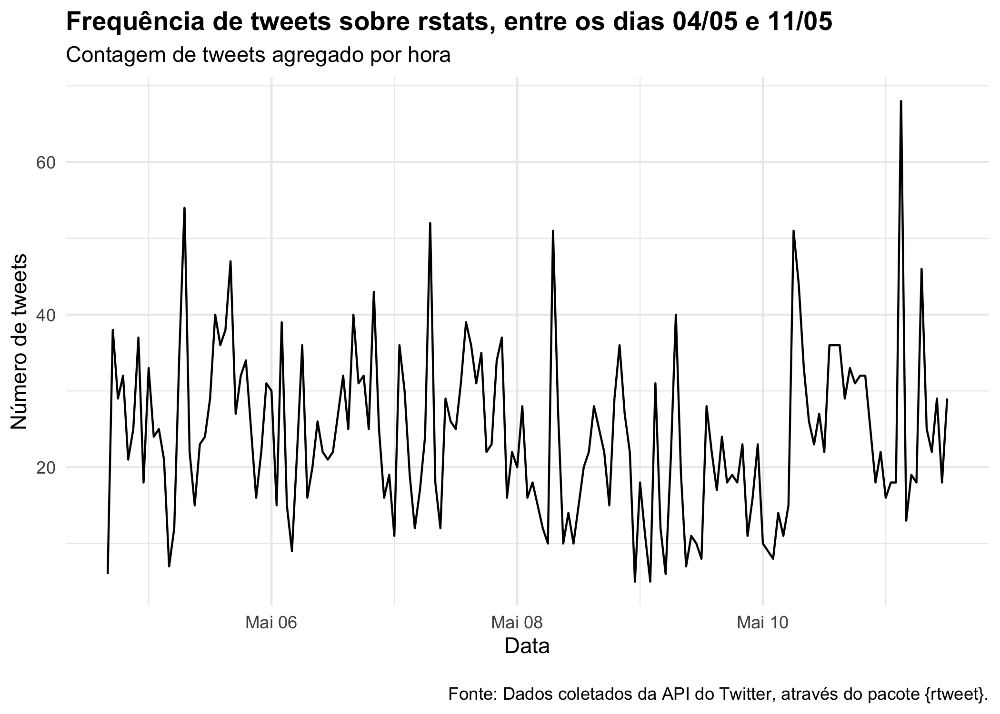
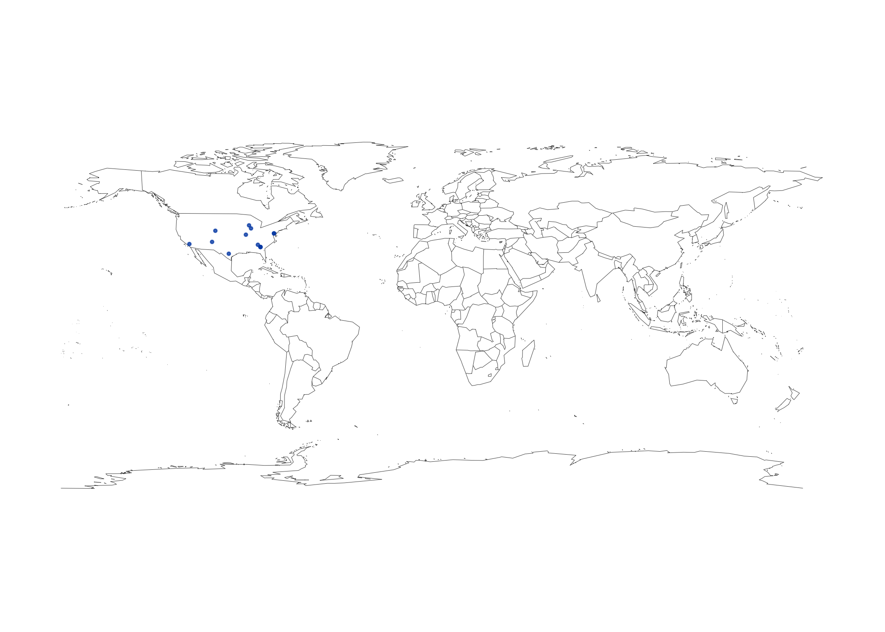
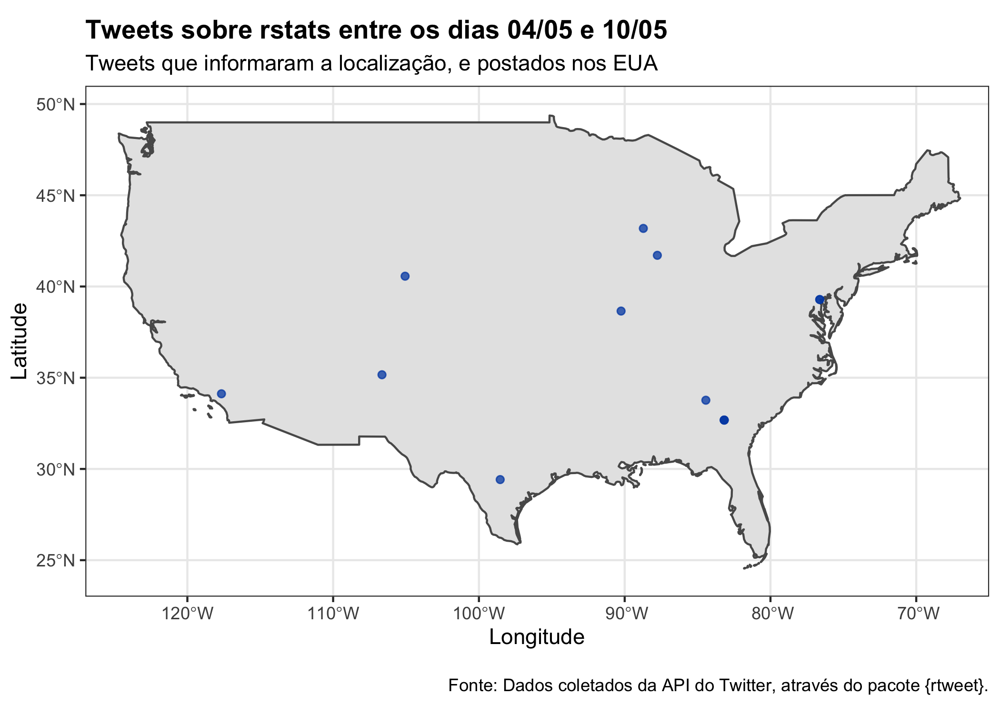

<!-- README.md is generated from README.Rmd. Please edit that file -->

# Day 2: Collecting Digital Trace Data

## Pre-arrival

-   Materiais disponíveis em: <https://sicss.io/curriculum>

> Importante: eu fiz pequenas modificações nos exercícios para não ficar
> exatamente igual ao código mostrado. Mas fiz os objetivos propostos :)
> , ex: coletar dados de uma API e fazer um gráfico, coletar dados do
> wikipedia, etc.

### What is Digital Trace Data?

-   “Pegadas digitais”. Novas possibilidades de acompanhar/estudar o
    comportamento humano em maior escala. Enquanto interagimos com a
    tecnologia, estamos deixando rastros digitais" do nosso
    comportamento.

-   Mostrou um exemplo de estudo: Eagle et al. 2010. O que podemos
    aprender com os dados? No estudo mostrado, a diversidade da rede de
    contatos das pessoas e as pessoas que elas conectavam nas redes
    sociais foram relacionadas com desigualdade econômica e diversidade.

-   Dados de celular! Onde as pessoas estão? Estão em casa? Relacionado
    com COVID-19: no futuro (talvez próximo) poderemos saber se as
    pessoas estão respeitando a quarentena (ou outras regras).

-   Digital trace data: são grandes bases de dados digitais, que
    permitem estudar o comportamento humano em uma escala jamais vista.
    Exemplo: redes sociais, dados de pesquisa na internet, blogs, dados
    geo-espaciais, audio-visual, arquivos históricos, registros
    administrativos. Qualquer tipo de pegada digital que deixamos! Esses
    dados nos permitem viajar no tempo, é possível acessar uma página da
    internet no passado.

-   Esses dados raramente são “perfeitos”. Falamos anteriormente que em
    CS separamos os dados “custom-made” e os dados “ready-made” (falado
    anteriormente na [aula
    1-1](https://github.com/beatrizmilz/2021-SICSS/blob/master/notes/Day_1-Introduction_and_Ethics/README.md#introduction-to-computational-social-science)).
    Nesse caso, os dados que usamos aqui são mais “ready-made”: são
    dados criados com um objetivo, e usamos esses dados com outros
    objetivos.

### Strengths and Weakness of Digital Trace Data

-   “Forças” da Digital trace data:

    -   Big: tem mais dados, e dados muito grandes! Avanços em poder
        computacional também permite que a gente consiga
        coletar/analisar esses dados.

    -   Always on: sempre disponível. Exemplo: redes sociais apresentam
        um registro do que está acontecendo on-line.

    -   Non-reactive: não resulta de uma interação onde a pessoa
        pesquisadora pergunta a opinião de uma pessoa que está
        participando do estudo (ex. entrevista, survey, grupo focal,
        etc). Isso é bem relevante quando se trata de pesquisas onde as
        perguntas feitas na entrevista/survey/grupo focal são de temas
        que possam constranger as pessoas participantes, e que elas não
        queiram responder.

    -   Capture social relationships: conseguimos dados das redes
        sociais.

-   “Fraquezas” da Digital trace data:

    -   Inaccessible: muito dos dados (e muitos dados valiosos para
        entender o comportamento humano) atualmente é inacessível, pois
        estão na posse de grandes empresas (como Google, Apple, Amazon,
        etc). Muitas vezes elas não podem disponibilizar essas bases de
        dados por questões legais.

    -   Non-representative: os dados não representam a população
        inteira. Pensando em redes sociais: % de pessoas da população
        que usa essa rede, pensar na presença grupos em termos de idade,
        sexo, urbano/rural, grupos minoritários, etc. Se queremos
        estudar dados de, por exemplo, twitter, precisamos estar cientes
        dessas vieses. E essas porcentagens da população nas redes
        sociais muda ao longo do tempo, e entre as plataformas. E se os
        dados conter vieses (bias), e não reflete fielmente a população
        que estamos tentando estudar?

    -   Drifting: as plataformas usadas mudam com o tempo, as pessoas
        migram de redes sociais (ex: myspace -&gt; facebook). A relação
        entre as pessoas e as plataformas usadas também muda com o
        tempo. Então precisamos ter atenção à isso: se queremos estudar
        um intervalo de tempo, pensar em quais plataformas eram usadas
        nesse período (e por quem).

    -   Algorithimically confounded: situação onde um algoritmo dentro
        de uma plataforma digital é alterado, e isso cria uma mudança no
        que vemos de comportamento humano. Interpretamos essa mudança
        como algo significativo, porém pode ser apenas a forma como as
        pessoas estão interagindo com o algoritmo. A caixa preta de ML:
        em alguns casos, não sabemos o que está causando algo.

    -   Unstructured: os dados são bagunçados e não estruturados! A
        maior parte do tempo das pessoas que trabalham com ciência de
        dados é usada limpando e arrumando dados!

    -   Sensitive: muitas pegadas digitais são informações privadas e
        sensíveis. Ex: dados de redes de relacionamento (ok cupid).

    -   Incomplete: os dados podem estar incompletos. Em alguns casos
        está relacionado as regras da plataforma usada para coletar os
        dados.

    -   Elite/publication bias: teremos uma fotografia distorcida da
        realidade. Em alguns casos, as informações encontradas são a
        visão de pessoas em situação privilegiada (ex comum em
        documentos históricos). Ex nas redes sociais: as pessoas estão
        postando coisas para fazer com que elas tenham mais status (look
        better).

    -   Positivity-bias: Nas redes sociais, as pessoas postam mais
        coisas positivas, e não postam tanto as coisas negativas.

-   O futuro do digital trace data: temos que encontrar formas de nos
    aproveitar das forças do DTD, ao mesmo tempo reconhecer as fraquezas
    de DTD (e lidar com isso). As melhores pesquisas futuras em CSC
    serão híbridas: usando dados ready-made e custom-made.

### Application Programming Interfaces (API)

-   O que é uma API?

    -   É uma das principais ferramentas usadas na CSC que quer estudar
        digital trace data.

    -   Possibilita coletar dados de algumas redes sociais, mas não
        apenas!

    -   A API possibilita alguns grupos de pessoas a acessarem alguns
        tipos de dados. Os dados disponíveis pode depender devido às
        credenciais (credentials).

    -   Muitas APIs não são públicas: existem dentro de uma empresa, ou
        entre duas companhias para transmitir dados.

    -   O número de APIs está crescendo! Pesquisar por APIs

        -   [Programmable
            Web](https://www.programmableweb.com/category/all/apis)
        -   [Any API](https://any-api.com/)

-   Como uma API funciona?

    -   Para criar a URL para buscar dados em uma API: Base API URL +
        Requested Filds/Data (endpoints) + Data format requested
        (usually JSON) + Query + API Key (credential/token)

    -   JSON é uma forma eficiente para armazenar dados, e é muito usado
        em API

    -   Para usar a API, lemos a documentação para descobrir como criar
        as URLs que devemos usar. A documentação é um manual.

    -   API credential/access token: algumas APIs não pedem credenciais.

    -   Rate limiting: uma API tem regras sobre a quantidade de dados
        que é permitido coletar em um intervalo determinado de tempo.
        Entender isso, e se necessário, colocar pausas no código.
        Throttling: o site mostra que está perto de atingir o rate limit
        e retorna os dados cada vez mais devagar.

    -   Exemplo com twitter: buscar dados na API do twitter. Usar no
        maximo n = 18 mil. Essa busca com a API simples só busca os
        dados recentes. O argumento `retryonratelimit` da função
        `rtweet::search_tweets()` é útil nesse caso.

-   Autenticando:

``` r
# install.packages("rtweet")
library(magrittr, include.only = "%>%")

# A forma de realizar a autenticação mostrada no video 
# estava gerando um erro. Nas issues do pacote, encontrei
# outras pessoas com o mesmo erro. Uma das sugestões que
# encontrei por lá é essa função bearer_token(), 
# que funcionou bem :)

rtweet::bearer_token()
```

-   Buscando os tweets

``` r
# Fiz a pesquisa com outro termo..
tweets <- rtweet::search_tweets(
  q = "rstats", # query para buscar
  n = 4000,  # número de tweets para coletar
  include_rts = FALSE # queremos os RTs ou não?
  )

# salvei o resultado pra nao precisar ficar coletando
# sempre que eu executar esse código (é demorado)

readr::write_rds(tweets, file = "exemplo_tweets.Rds")
```

``` r
# abrindo os tweets salvos
tweets_salvos <- readr::read_rds("exemplo_tweets.Rds")

# carregando apenas o pipe:
library(magrittr, include.only = "%>%") 

# não quero ver a base toda, tem muitas colunas!
tweets_salvos %>% 
  dplyr::select(created_at, screen_name, text) 
#> # A tibble: 4,000 x 3
#>    created_at          screen_name   text                                       
#>    <dttm>              <chr>         <chr>                                      
#>  1 2021-05-11 12:55:22 theRcast      "A great surprise to start the ☀️ : My abst…
#>  2 2021-05-11 12:52:10 theRcast      "A great surprise to start the ☀️: My abstr…
#>  3 2021-05-08 12:52:09 theRcast      "@moriah_taylor58 That's great! We are sta…
#>  4 2021-05-11 10:56:57 theRcast      "My week of ✍️ ➕🎙 for #rstats @rweekly_org …
#>  5 2021-05-05 13:27:17 theRcast      "@cantabile {renv} is the easiest path to …
#>  6 2021-05-07 12:51:36 vsni          "Our free tool ASRgenomics offers molecula…
#>  7 2021-05-11 12:45:56 vsni          "ASRgenomics facilitates the generation of…
#>  8 2021-05-07 12:53:39 ASreml        "Our free tool ASRgenomics offers molecula…
#>  9 2021-05-11 12:43:45 ASreml        "ASRgenomics facilitates the generation of…
#> 10 2021-05-08 18:41:00 SourabhSKato… "Learn Practical Text Classification With …
#> # … with 3,990 more rows
```

-   Quais são as colunas presentes?

``` r
names(tweets_salvos)
#>  [1] "user_id"                 "status_id"              
#>  [3] "created_at"              "screen_name"            
#>  [5] "text"                    "source"                 
#>  [7] "display_text_width"      "reply_to_status_id"     
#>  [9] "reply_to_user_id"        "reply_to_screen_name"   
#> [11] "is_quote"                "is_retweet"             
#> [13] "favorite_count"          "retweet_count"          
#> [15] "quote_count"             "reply_count"            
#> [17] "hashtags"                "symbols"                
#> [19] "urls_url"                "urls_t.co"              
#> [21] "urls_expanded_url"       "media_url"              
#> [23] "media_t.co"              "media_expanded_url"     
#> [25] "media_type"              "ext_media_url"          
#> [27] "ext_media_t.co"          "ext_media_expanded_url" 
#> [29] "ext_media_type"          "mentions_user_id"       
#> [31] "mentions_screen_name"    "lang"                   
#> [33] "quoted_status_id"        "quoted_text"            
#> [35] "quoted_created_at"       "quoted_source"          
#> [37] "quoted_favorite_count"   "quoted_retweet_count"   
#> [39] "quoted_user_id"          "quoted_screen_name"     
#> [41] "quoted_name"             "quoted_followers_count" 
#> [43] "quoted_friends_count"    "quoted_statuses_count"  
#> [45] "quoted_location"         "quoted_description"     
#> [47] "quoted_verified"         "retweet_status_id"      
#> [49] "retweet_text"            "retweet_created_at"     
#> [51] "retweet_source"          "retweet_favorite_count" 
#> [53] "retweet_retweet_count"   "retweet_user_id"        
#> [55] "retweet_screen_name"     "retweet_name"           
#> [57] "retweet_followers_count" "retweet_friends_count"  
#> [59] "retweet_statuses_count"  "retweet_location"       
#> [61] "retweet_description"     "retweet_verified"       
#> [63] "place_url"               "place_name"             
#> [65] "place_full_name"         "place_type"             
#> [67] "country"                 "country_code"           
#> [69] "geo_coords"              "coords_coords"          
#> [71] "bbox_coords"             "status_url"             
#> [73] "name"                    "location"               
#> [75] "description"             "url"                    
#> [77] "protected"               "followers_count"        
#> [79] "friends_count"           "listed_count"           
#> [81] "statuses_count"          "favourites_count"       
#> [83] "account_created_at"      "verified"               
#> [85] "profile_url"             "profile_expanded_url"   
#> [87] "account_lang"            "profile_banner_url"     
#> [89] "profile_background_url"  "profile_image_url"
```

-   Criar um gráfico

``` r
dia_min <- format(min(tweets_salvos$created_at), "%d/%m")
dia_max <- format(max(tweets_salvos$created_at), "%d/%m")

tweets_salvos %>% 
  rtweet::ts_plot(by = "hours") +
  ggplot2::theme_minimal() + 
  ggplot2::theme(plot.title = ggplot2::element_text(face = "bold")) +
  ggplot2::labs(x = "Data", y = "Número de tweets",
                title = glue::glue("Frequência de tweets sobre rstats, entre os dias {dia_min} e {dia_max}"),
                subtitle = "Contagem de tweets agregado por hora",
                caption = "\nFonte: Dados coletados da API do Twitter, através do pacote {rtweet}.")
```



-   Ver os tweets em uma região (EUA)

``` r
geo_tweets <- rtweet::search_tweets(
  q = "rstats", # query para buscar
  n = 4000,  # número de tweets para coletar
  include_rts = FALSE, # queremos os RTs ou não?
  geocode = rtweet::lookup_coords("usa"),
  type = "recent"
  )

# salvei o resultado pra nao precisar ficar coletando
# sempre que eu executar esse código (é demorado)

readr::write_rds(geo_tweets, file = "exemplo_geo_tweets.Rds")
```

``` r
# abrindo os tweets salvos
tweets_geo_salvos <- readr::read_rds("exemplo_geo_tweets.Rds")

# arrumando as colunas lat long
geocoded <- rtweet::lat_lng(tweets_geo_salvos)
```

``` r
# plotando o mapa com o pacote maps
par(mar = c(0, 0, 0, 0))
maps::map("world", lwd = .25)
with(geocoded, points(
  lng,
  lat,
  pch = 20,
  cex = .50,
  col = rgb(0, .3, .7, .75)
))
```



``` r
world <-
  rnaturalearth::ne_countries(scale = "medium", returnclass = "sf")

sf_usa <-
  world %>% dplyr::filter(admin == "United States of America")

geocoded_filtrado_sf <- geocoded %>%
  tidyr::drop_na(lat, lng) %>%
  sf::st_as_sf(coords = c("lng", "lat"), crs = 4326)

dia_min <- format(min(geocoded_filtrado_sf$created_at), "%d/%m")
dia_max <- format(max(geocoded_filtrado_sf$created_at), "%d/%m")


  geocoded_filtrado_sf %>% 
  ggplot2::ggplot() +
  ggplot2::geom_sf(data = sf_usa) +
  ggplot2::geom_sf(color = rgb(0, .3, .7, .75)) +
  ggplot2::theme_bw() +
  ggplot2::coord_sf(xlim = c(-127, -65),
                    ylim = c(23, 51),
                    expand = FALSE) +
  ggplot2::theme(plot.title = ggplot2::element_text(face = "bold")) +
  ggplot2::labs(
    x = "Longitude",
    y = "Latitude",
    title = glue::glue(
      "Tweets sobre rstats entre os dias {dia_min} e {dia_max}"
    ),
    subtitle = "Tweets que informaram a localização, e postados nos EUA",
    caption = "\nFonte: Dados coletados da API do Twitter, através do pacote {rtweet}."
  )
```



-   No exemplo, mostrou mais coisas que podemos fazer com o pacote
    rtweet.

-   Função pra checar o rate limit:

``` r
head(rtweet::rate_limit()[50:55, 1:4])
#> # A tibble: 6 x 4
#>   query                                             limit remaining reset       
#>   <chr>                                             <int>     <int> <drtn>      
#> 1 users/by/username/:source_username/following&POST    50        50 15.02261 mi…
#> 2 users/:id/followers                                  15        15 15.02261 mi…
#> 3 users/suggestions/:slug/members                      15        15 15.02261 mi…
#> 4 users/:id/following                                  15        15 15.02261 mi…
#> 5 users/:id/mentions                                  180       180 15.02261 mi…
#> 6 users/by/username/:username                         900       900 15.02261 mi…
```

-   Postar tweets: `rtweet::post_tweet()`

-   Podemos fazer um loop para repetir a busca :)

-   APIs podem ser usadas não apenas para coletar dados, mas também para
    visualização/análise/modelagem

-   Desafios ao trabalhar com APIs:

    -   Muitos dados ainda não estão disponíveis publicamente.

    -   Cada API tem seus padrões, então aprender a usar uma API
        significa que precisamos ler com cuidado a documentação.

-   O final do video está repetido.

### Screen Scraping

-   Screen-scraping: tentar extrair dados de uma página da internet, e
    adicionar em uma base de dados.

-   Imagem interessante [no
    slide](https://sicss.io/2020/materials/day2-digital-trace-data/screenscraping/Rpres/Screenscraping.html#/2)

-   Sreen-scraping é permitido por lei? O melhor é buscar os dados em
    uma API. Consultar os termos de serviço do site que queremos fazer a
    raspagem, e também o arquivo robots.txt . Além disso, ele aconselha
    conversar com a equipe da universidade que pode dar conselhos
    relacionados à questão legal.

-   Screen-scraping é frustrante

-   Ler a página web no R: pacote útil para isso é o {rvest}

Exercício: iremos buscar dados do wikipedia.

Busquei outra página, para ficar diferente do exemplo dado :)

Caso alguém queira baixar os dados a seguir, ver:
[wiki\_naruto\_shippuden.Rds](wiki_naruto_shippuden.Rds)

``` r
url_wiki <-
  "https://pt.wikipedia.org/wiki/Lista_de_epis%C3%B3dios_de_Naruto_Shippuden"

wikipedia_page  <- rvest::read_html(url_wiki)

buscar_tabela <- function(n_tabela, n_season) {
  rvest::html_node(
    wikipedia_page,
    xpath = glue::glue('//*[@id="mw-content-text"]/div[1]/table[{n_tabela}]')
  ) %>%
    rvest::html_table() %>%
    janitor::clean_names() %>%
    dplyr::transmute(
      temporada = n_season,
      n_ep = as.character(no),
      titulo = titulo_original,
      data_de_estreia
    )
  }

tabela_temporadas <- seq(4, 42, by = 2)

tabela_suja <-
  purrr::map2_dfr(tabela_temporadas, 1:20, buscar_tabela)


eps_naruto_shippuden <- tabela_suja %>%
  tidyr::separate(n_ep, into = c("n_ep", "tipo_episodio"), "\\(") %>%
  dplyr::mutate(
    n_ep = readr::parse_number(n_ep),
    data_de_estreia = readr::parse_date(
      data_de_estreia,
      format = "%d de %B de %Y",
      locale = readr::locale("pt")
    ),
    tipo_episodio = stringr::str_replace_all(tipo_episodio, "\\)", "")
  ) %>%
  tidyr::drop_na(n_ep) %>%
  tibble::rowid_to_column() %>%
  dplyr::filter(rowid %% 2 != 0) %>%
  dplyr::select(-rowid)  %>% 
  dplyr::mutate(tipo_episodio = dplyr::case_when(
    is.na(tipo_episodio) ~ "Canon",
    tipo_episodio == "½filler" ~ "Semi-filler",
    TRUE ~ tipo_episodio
  ))

readr::write_rds(eps_naruto_shippuden, "wiki_naruto_shippuden.Rds")
```

``` r
eps_naruto_shippuden <- readr::read_rds("wiki_naruto_shippuden.Rds")

eps_naruto_shippuden %>%
  knitr::kable()
```

| temporada | n\_ep | tipo\_episodio | titulo                                                                 | data\_de\_estreia |
|----------:|------:|:---------------|:-----------------------------------------------------------------------|:------------------|
|         1 |     1 | Canon          | Volta para Casa                                                        | 2007-02-15        |
|         1 |     2 | Canon          | A Akatsuki se Move                                                     | 2007-02-15        |
|         1 |     3 | Canon          | Os Frutos do Treinamento                                               | 2007-02-22        |
|         1 |     4 | Canon          | O Jinchuriki da Areia                                                  | 2007-03-01        |
|         1 |     5 | Canon          | Como Kazekage…!                                                        | 2007-03-15        |
|         1 |     6 | Canon          | Missão Apurada                                                         | 2007-03-29        |
|         1 |     7 | Canon          | Corra, Kankuro                                                         | 2007-03-29        |
|         1 |     8 | Canon          | Time Kakashi se Prepara                                                | 2007-04-12        |
|         1 |     9 | Canon          | Lágrimas de Jinchuriki                                                 | 2007-04-12        |
|         1 |    10 | Canon          | Fuin Jutsu: Genryu Kyu Fujin                                           | 2007-04-19        |
|         1 |    11 | Canon          | A Discípula da Ninja Médica                                            | 2007-04-26        |
|         1 |    12 | Canon          | A Decisão da Velhota Aposentada                                        | 2007-05-03        |
|         1 |    13 | Canon          | Encontros Predestinados                                                | 2007-05-10        |
|         1 |    14 | Canon          | O Crescimento de Naruto                                                | 2007-05-17        |
|         1 |    15 | Canon          | O Nome da Arma Secreta É…!                                             | 2007-05-24        |
|         1 |    16 | Canon          | O Segredo dos Jinchuriki                                               | 2007-05-31        |
|         1 |    17 | Canon          | A Morte de Gaara!                                                      | 2007-06-07        |
|         1 |    18 | Canon          | Invasão! Entrada Gancho Lateral                                        | 2007-06-21        |
|         1 |    19 | Canon          | Armadilha Ativada! Os Inimigos do Time Guy                             | 2007-07-05        |
|         1 |    20 | Canon          | Hiruko VS as Duas Kunoichi                                             | 2007-07-19        |
|         1 |    21 | Canon          | A Real Face de Sasori                                                  | 2007-07-26        |
|         1 |    22 | Canon          | A Carta na Manga da Chiyo                                              | 2007-08-02        |
|         1 |    23 | Canon          | “Pai” e “Mãe”                                                          | 2007-08-02        |
|         1 |    24 | Canon          | Terceiro Kazekage                                                      | 2007-08-09        |
|         1 |    25 | Canon          | Três Minutos Entre a Vida e a Morte                                    | 2007-08-16        |
|         1 |    26 | Canon          | Dez Marionetes vs Cem Marionetes                                       | 2007-08-23        |
|         1 |    27 | Canon          | Sonho que Não se Realizará                                             | 2007-08-30        |
|         1 |    28 | Canon          | As Bestas que Ressuscitam                                              | 2007-09-13        |
|         1 |    29 | Canon          | Kakashi Abre o Olho!                                                   | 2007-09-27        |
|         1 |    30 | Canon          | A Estética do Momento                                                  | 2007-09-27        |
|         2 |    31 | Canon          | Algo que se Herda                                                      | 2007-10-18        |
|         2 |    32 | Canon          | O Retorno do Kazekage                                                  | 2007-10-25        |
|         2 |    33 | Canon          | Um Novo Objetivo                                                       | 2007-11-08        |
|         2 |    34 | Canon          | Formação! O Novo Time Kakashi                                          | 2007-11-15        |
|         2 |    35 | Canon          | Parceiro Indesejado                                                    | 2007-11-22        |
|         2 |    36 | Canon          | O Sorriso Falso                                                        | 2007-11-29        |
|         2 |    37 | Canon          | Sem Título                                                             | 2007-11-29        |
|         2 |    38 | Canon          | Simulação                                                              | 2007-12-06        |
|         2 |    39 | Canon          | Ponte Tenchi                                                           | 2007-12-13        |
|         2 |    40 | Canon          | A Kyuubi se Liberta!!                                                  | 2007-12-20        |
|         2 |    41 | Canon          | A Missão Super-Secreta Começa                                          | 2007-12-20        |
|         2 |    42 | Canon          | Orochimaru VS Jinchuriki                                               | 2008-01-10        |
|         2 |    43 | Canon          | As Lágrimas da Sakura                                                  | 2008-01-17        |
|         2 |    44 | Canon          | As Verdades da Batalha                                                 | 2008-01-24        |
|         2 |    45 | Canon          | O Limite da Traição                                                    | 2008-01-31        |
|         2 |    46 | Canon          | A Página Inacabada                                                     | 2008-02-07        |
|         2 |    47 | Canon          | Infiltração! O Esconderijo da Serpente                                 | 2008-02-14        |
|         2 |    48 | Canon          | Laços                                                                  | 2008-02-28        |
|         2 |    49 | Canon          | Algo Precioso                                                          | 2008-03-06        |
|         2 |    50 | Canon          | O Conto do Livro Ilustrado                                             | 2008-03-13        |
|         2 |    51 | Canon          | Reunião                                                                | 2008-03-20        |
|         2 |    52 | Canon          | O Poder Uchiha                                                         | 2008-03-20        |
|         2 |    53 | Canon          | Título                                                                 | 2008-04-03        |
|         3 |    54 | Semi-filler    | Pesadelo                                                               | 2008-04-03        |
|         3 |    55 | Canon          | Vento                                                                  | 2008-04-17        |
|         3 |    56 | Semi-filler    | Contorcer                                                              | 2008-04-24        |
|         3 |    57 | Filler         | Retirado do Sono Eterno                                                | 2008-05-08        |
|         3 |    58 | Filler         | Solidão                                                                | 2008-05-08        |
|         3 |    59 | Filler         | Novo Inimigo                                                           | 2008-05-15        |
|         3 |    60 | Filler         | Mutabilidade                                                           | 2008-05-22        |
|         3 |    61 | Filler         | Contato                                                                | 2008-05-29        |
|         3 |    62 | Filler         | Parceito de Time                                                       | 2008-06-05        |
|         3 |    63 | Filler         | Dois Reis                                                              | 2008-06-19        |
|         3 |    64 | Filler         | Sinal das Chamas Negras                                                | 2008-07-03        |
|         3 |    65 | Filler         | Aprisionada na Escuridão                                               | 2008-07-03        |
|         3 |    66 | Filler         | Almas Ressuscitadas                                                    | 2008-07-10        |
|         3 |    67 | Filler         | A Batalha Mortal de Cada Um                                            | 2008-07-24        |
|         3 |    68 | Filler         | Hora de Despertar                                                      | 2008-07-31        |
|         3 |    69 | Filler         | Desespero                                                              | 2008-07-31        |
|         3 |    70 | Filler         | Ressonância                                                            | 2008-08-07        |
|         3 |    71 | Semi-filler    | Meu Amigo                                                              | 2008-08-14        |
|         3 |    72 | Canon          | Uma Ameaça se Aproxima                                                 | 2008-08-21        |
|         3 |    73 | Canon          | Invasão da “Akatsuki”                                                  | 2008-08-28        |
|         3 |    74 | Canon          | Sob o Céu Estrelado                                                    | 2008-09-04        |
|         3 |    75 | Canon          | A Oração de Um Velho Sacerdote                                         | 2008-09-11        |
|         3 |    76 | Canon          | O Próximo Passo                                                        | 2008-09-25        |
|         3 |    77 | Canon          | Escalada de Prata                                                      | 2008-09-25        |
|         4 |    78 | Canon          | O Julgamento Dado                                                      | 2008-10-02        |
|         4 |    79 | Canon          | Grito Não Comprido                                                     | 2008-10-02        |
|         4 |    80 | Canon          | Últimas Palavras                                                       | 2008-10-16        |
|         4 |    81 | Canon          | Notícia Devastante                                                     | 2008-10-23        |
|         4 |    82 | Canon          | Time 10                                                                | 2008-10-30        |
|         4 |    83 | Canon          | Alvo Travado                                                           | 2008-11-06        |
|         4 |    84 | Canon          | A Habilidade de Kakuzu                                                 | 2008-11-13        |
|         4 |    85 | Canon          | O Terrível Segredo                                                     | 2008-11-20        |
|         4 |    86 | Canon          | O Gênio Shikamaru                                                      | 2008-12-04        |
|         4 |    87 | Canon          | Quando Amaldiçoar Alguém, Cave Duas Covas                              | 2008-12-04        |
|         4 |    88 | Canon          | Futon: Rasen-Shuriken!                                                 | 2008-12-11        |
|         4 |    89 | Canon          | O Preço do Poder                                                       | 2008-12-18        |
|         4 |    90 | Semi-filler    | A Decisão de um Shinobi                                                | 2008-12-25        |
|         4 |    91 | Filler         | Descoberto, o Esconderijo de Orochimaru                                | 2009-01-08        |
|         4 |    92 | Semi-filler    | Encontro                                                               | 2009-01-15        |
|         4 |    93 | Filler         | Corações se Comunicando                                                | 2009-01-22        |
|         4 |    94 | Filler         | Noite de Chuva                                                         | 2009-01-29        |
|         4 |    95 | Filler         | Dois Amuletos                                                          | 2009-02-05        |
|         4 |    96 | Filler         | Inimigo Invisível                                                      | 2009-02-12        |
|         4 |    97 | Filler         | Labirinto de Reflexos                                                  | 2009-02-19        |
|         4 |    98 | Filler         | Aparece o Alvo                                                         | 2009-02-26        |
|         4 |    99 | Filler         | Biju Enlouquecido                                                      | 2009-03-05        |
|         4 |   100 | Filler         | Dentro da Névoa                                                        | 2009-03-12        |
|         4 |   101 | Filler         | Sentimentos de Cada Um                                                 | 2009-03-26        |
|         4 |   102 | Filler         | Reorganização!                                                         | 2009-03-26        |
|         5 |   103 | Filler         | Kekkai Shiho Fujin                                                     | 2009-04-09        |
|         5 |   104 | Filler         | Elemento Cristal Destruído                                             | 2009-04-09        |
|         5 |   105 | Filler         | Batalha Sobre a Barreira                                               | 2009-04-16        |
|         5 |   106 | Filler         | Camélia Vermelha                                                       | 2009-04-23        |
|         5 |   107 | Filler         | Amigos Estranhos                                                       | 2009-04-30        |
|         5 |   108 | Filler         | Diretrizes das Camélias                                                | 2009-05-07        |
|         5 |   109 | Filler         | Contra-ataque do Selo Amaldiçoado                                      | 2009-05-14        |
|         5 |   110 | Filler         | Memórias do Crime                                                      | 2009-05-21        |
|         5 |   111 | Filler         | Promessa Quebrada                                                      | 2009-05-28        |
|         5 |   112 | Semi-filler    | O Lugar Para Retornar                                                  | 2009-06-04        |
|         5 |   113 | Canon          | O Discípulo da Serpente                                                | 2009-06-11        |
|         5 |   114 | Canon          | O Olho do Falcão                                                       | 2009-06-18        |
|         5 |   115 | Semi-filler    | A Espada de Zabuza                                                     | 2009-06-25        |
|         5 |   116 | Canon          | A Guardiã da Muralha de Ferro                                          | 2009-07-02        |
|         5 |   117 | Canon          | Jugo do Esconderijo do Norte                                           | 2009-07-09        |
|         5 |   118 | Canon          | Formação!                                                              | 2009-07-23        |
|         5 |   119 | Gaiden         | Crônicas do Kakashi \~A Vida de um Garoto no Campo de Batalha\~ Início | 2009-07-30        |
|         5 |   120 | Gaiden         | Crônicas do Kakashi \~A Vida de um Garoto no Campo de Batalha\~ Fim    | 2009-07-30        |
|         5 |   121 | Canon          | Aqueles que se Movem                                                   | 2009-08-06        |
|         5 |   122 | Canon          | Caçada                                                                 | 2009-08-13        |
|         5 |   123 | Canon          | Confronto!                                                             | 2009-08-20        |
|         5 |   124 | Canon          | Arte                                                                   | 2009-08-27        |
|         5 |   125 | Canon          | Desaparecimento                                                        | 2009-09-03        |
|         5 |   126 | Canon          | Crepúsculo                                                             | 2009-09-10        |
|         5 |   127 | Gaiden         | Contos do Ninja Determinado \~O Pergaminho de Jiraiya\~ Início         | 2009-09-24        |
|         5 |   128 | Gaiden         | Contos do Ninja Determinado \~O Pergaminho de Jiraiya\~ Fim            | 2009-09-24        |
|         6 |   129 | Canon          | Infiltração! Vila Oculta da Chuva                                      | 2009-10-08        |
|         6 |   130 | Canon          | O Homem que Virou um Deus                                              | 2009-10-08        |
|         6 |   131 | Canon          | Ativar! Modo Sennin                                                    | 2009-10-15        |
|         6 |   132 | Canon          | O Seis Caminhos de Pain, Apresentação                                  | 2009-10-22        |
|         6 |   133 | Canon          | O Conto do Destemido Jiraiya                                           | 2009-10-29        |
|         6 |   134 | Canon          | Convite Para a Festa                                                   | 2009-11-05        |
|         6 |   135 | Canon          | O Momento Demorado…                                                    | 2009-11-19        |
|         6 |   136 | Canon          | A Luz e as Trevas do Mangekyo Sharingan                                | 2009-11-19        |
|         6 |   137 | Canon          | Amaterasu                                                              | 2009-11-26        |
|         6 |   138 | Canon          | O Fim                                                                  | 2009-12-03        |
|         6 |   139 | Canon          | O Mistério de Tobi                                                     | 2009-12-10        |
|         6 |   140 | Canon          | Destino                                                                | 2009-12-17        |
|         6 |   141 | Canon          | Verdade                                                                | 2009-12-24        |
|         6 |   142 | Canon          | Batalha no Vale da Nuvem                                               | 2010-01-07        |
|         6 |   143 | Canon          | -Hachibi- Contra -Sasuke-                                              | 2010-01-14        |
|         6 |   144 | Filler         | Andarilho                                                              | 2010-01-21        |
|         6 |   145 | Filler         | Sucessor do Kinjutsu                                                   | 2010-01-28        |
|         6 |   146 | Filler         | Sentimentos do Sucessor                                                | 2010-02-04        |
|         6 |   147 | Filler         | Passado do Ninja Fugitivo                                              | 2010-02-11        |
|         6 |   148 | Filler         | Herdeiro da Escuridão                                                  | 2010-02-18        |
|         6 |   149 | Filler         | Separação                                                              | 2010-02-25        |
|         6 |   150 | Filler         | O Jutsu Probido Liberado                                               | 2010-03-04        |
|         6 |   151 | Filler         | Mestre e Discípulo                                                     | 2010-03-11        |
|         6 |   152 | Semi-filler    | Notícias Sombrias                                                      | 2010-03-25        |
|         6 |   153 | Canon          | Seguindo a Sombra do Mestre                                            | 2010-03-25        |
|         7 |   154 | Canon          | Decodificação                                                          | 2010-04-08        |
|         7 |   155 | Canon          | O Primeiro Desafio                                                     | 2010-04-08        |
|         7 |   156 | Canon          | Superando o Mestre                                                     | 2010-04-15        |
|         7 |   157 | Canon          | Ataque à Folha!                                                        | 2010-04-22        |
|         7 |   158 | Canon          | O Poder da Fé                                                          | 2010-04-29        |
|         7 |   159 | Canon          | Pain VS Kakashi                                                        | 2010-05-06        |
|         7 |   160 | Canon          | O Mistério de Pain                                                     | 2010-05-13        |
|         7 |   161 | Canon          | Eu Sou Konohamaru, do Clã Sarutobi!                                    | 2010-05-20        |
|         7 |   162 | Canon          | O Mundo Conhece a Dor                                                  | 2010-05-27        |
|         7 |   163 | Canon          | Explosão! Modo Sennin                                                  | 2010-06-03        |
|         7 |   164 | Canon          | Perigo! O Modo Sennin Desaparece                                       | 2010-06-10        |
|         7 |   165 | Canon          | Captura da Kyubi, Completa                                             | 2010-06-17        |
|         7 |   166 | Canon          | Confissão                                                              | 2010-06-24        |
|         7 |   167 | Canon          | Chibaku Tensei                                                         | 2010-07-01        |
|         7 |   168 | Canon          | Quarto Hokage                                                          | 2010-07-15        |
|         7 |   169 | Canon          | Os Dois Discípulos                                                     | 2010-07-22        |
|         7 |   170 | Filler         | Grande Aventura! A Busca pelo Legado do Quarto Hokage - Início         | 2010-07-29        |
|         7 |   171 | Filler         | Grande Aventura! A Busca pelo Legado do Quarto Hokage - Fim            | 2010-07-29        |
|         7 |   172 | Canon          | Encontro                                                               | 2010-08-05        |
|         7 |   173 | Canon          | O Nascimento de Pain                                                   | 2010-08-12        |
|         7 |   174 | Canon          | O Conto de Uzumaki Naruto                                              | 2010-08-19        |
|         7 |   175 | Canon          | O Herói da Folha                                                       | 2010-08-26        |
|         7 |   176 | Semi-filler    | Iruka, o Instrutor Novato                                              | 2010-09-02        |
|         7 |   177 | Filler         | O Teste de Iruka                                                       | 2010-09-09        |
|         7 |   178 | Semi-filler    | A Decisão de Iruka                                                     | 2010-09-16        |
|         7 |   179 | Semi-filler    | Hatake Kakashi, o Jonin Responsável                                    | 2010-09-30        |
|         8 |   180 | Semi-filler    | Inari, a Coragem Posta à Prova                                         | 2010-10-07        |
|         8 |   181 | Semi-filler    | Naruto, as Lições de Revanche                                          | 2010-10-14        |
|         8 |   182 | Filler         | Os “Laços” de Gaara                                                    | 2010-10-21        |
|         8 |   183 | Filler         | Naruto Incontrolável                                                   | 2010-10-28        |
|         8 |   184 | Filler         | Partaida! O Time Tenten                                                | 2010-11-04        |
|         8 |   185 | Filler         | Distrito Animal                                                        | 2010-11-11        |
|         8 |   186 | Filler         | Ah, a Pílula da Juventude                                              | 2010-11-18        |
|         8 |   187 | Filler         | Mestre e Aluno Corajosos, o Treinamento                                | 2010-11-25        |
|         8 |   188 | Filler         | Mestre e Aluno Corajosos, as Memórias                                  | 2010-11-25        |
|         8 |   189 | Filler         | A Enciclopédia de Patas do Sasuke                                      | 2010-12-02        |
|         8 |   190 | Filler         | Naruto e o Velho Soldado                                               | 2010-12-09        |
|         8 |   191 | Filler         | A Melodia de Amor de Kakashi                                           | 2010-12-16        |
|         8 |   192 | Filler         | Crônicas de Neji                                                       | 2010-12-23        |
|         8 |   193 | Filler         | O Homem que Já Morreu Duas Vezes                                       | 2011-01-06        |
|         8 |   194 | Filler         | A Pior Corrida de Três Pernas                                          | 2011-01-13        |
|         8 |   195 | Filler         | Cooperação, o Time 10                                                  | 2011-01-20        |
|         8 |   196 | Filler         | Apressado Rumo às Trevas                                               | 2011-01-27        |
|         8 |   197 | Canon          | O Sexto Hokage Danzo                                                   | 2011-02-10        |
|         8 |   198 | Canon          | Véspera da Reunião dos 5 Kages                                         | 2011-02-10        |
|         8 |   199 | Canon          | Os 5 Kages Aparecem!                                                   | 2011-02-17        |
|         8 |   200 | Canon          | O Pedido de Naruto                                                     | 2011-02-24        |
|         8 |   201 | Canon          | A Dolorosa Decisão                                                     | 2011-03-03        |
|         8 |   202 | Canon          | Correndo Com o Trovão                                                  | 2011-03-10        |
|         8 |   203 | Canon          | O Jeito Ninja do Sasuke                                                | 2011-03-17        |
|         8 |   204 | Canon          | O Poder dos Cinco Kages                                                | 2011-03-24        |
|         8 |   205 | Canon          | Declaração de Guerra                                                   | 2011-03-31        |
|         9 |   206 | Canon          | Os Sentimentos da Sakura                                               | 2011-04-07        |
|         9 |   207 | Canon          | Biju VS Biju sem Cauda                                                 | 2011-04-14        |
|         9 |   208 | Canon          | Como um Amigo                                                          | 2011-04-21        |
|         9 |   209 | Canon          | O Braço Direito de Danzo                                               | 2011-04-28        |
|         9 |   210 | Canon          | O Dojutsu Proibido                                                     | 2011-05-05        |
|         9 |   211 | Canon          | Shimura Danzo                                                          | 2011-05-12        |
|         9 |   212 | Canon          | A Determinação de Sakura                                               | 2011-05-19        |
|         9 |   213 | Canon          | Laços Desfeitos                                                        | 2011-05-26        |
|         9 |   214 | Canon          | O Fardo que Carrego                                                    | 2011-06-02        |
|         9 |   215 | Canon          | Dois Destinos                                                          | 2011-06-09        |
|         9 |   216 | Canon          | Ninjas de Alto Nível                                                   | 2011-06-16        |
|         9 |   217 | Canon          | O Infiltrado                                                           | 2011-06-23        |
|         9 |   218 | Canon          | As Grandes Nações se Movem                                             | 2011-06-30        |
|         9 |   219 | Canon          | O Hokage Hatake Kakashi                                                | 2011-07-07        |
|         9 |   220 | Canon          | A Profecia de Ogama Sennin                                             | 2011-07-21        |
|         9 |   221 | Canon          | Armazenamento                                                          | 2011-07-28        |
|         9 |   222 | Canon          | A Decisão dos Cinco Kages                                              | 2011-07-28        |
|         9 |   223 | Filler         | O Jovem e o Oceano                                                     | 2011-08-04        |
|         9 |   224 | Filler         | Os Mercadores Ninjas de Benisu                                         | 2011-08-11        |
|         9 |   225 | Filler         | O Navio Fantasma Amaldiçoado                                           | 2011-08-18        |
|         9 |   226 | Filler         | Ilha do Navio de Guerra                                                | 2011-08-25        |
|         9 |   227 | Filler         | Ilha do Esquecimento                                                   | 2011-09-01        |
|         9 |   228 | Filler         | Lute, Rock Lee!                                                        | 2011-09-08        |
|         9 |   229 | Filler         | Coma ou Morra!? Os Cogumelos do Inferno                                | 2011-09-22        |
|         9 |   230 | Filler         | O Contra-ataque das Sombras                                            | 2011-09-29        |
|        10 |   231 | Filler         | A Rota Fechada                                                         | 2011-10-06        |
|        10 |   232 | Filler         | As Meninas se Reúnem                                                   | 2011-10-13        |
|        10 |   233 | Filler         | Apresentando o Impostor? Naruto                                        | 2011-10-20        |
|        10 |   234 | Filler         | O Discípulo Favorito de Naruto                                         | 2011-10-27        |
|        10 |   235 | Filler         | A Kunoichi de Nadeshiko                                                | 2011-11-03        |
|        10 |   236 | Filler         | Companheiros de Verdade                                                | 2011-11-10        |
|        10 |   237 | Filler         | Ah, Minha Heroína Tsunade-sama                                         | 2011-11-24        |
|        10 |   238 | Filler         | O Descanso de Sai                                                      | 2011-12-01        |
|        10 |   239 | Filler         | A Lenda de Ino-Shika-Cho                                               | 2011-12-08        |
|        10 |   240 | Filler         | A Determinação de Kiba                                                 | 2011-12-15        |
|        10 |   241 | Filler         | Kakashi, Meu Eterno Rival                                              | 2011-12-22        |
|        10 |   242 | Filler         | O Juramento de Naruto                                                  | 2011-12-28        |
|        10 |   243 | Canon          | Terra a Vista! A Ilha Paradisíaca?                                     | 2012-01-05        |
|        10 |   244 | Canon          | Killer Bee e Motoi                                                     | 2012-01-12        |
|        10 |   245 | Canon          | Próximo Desafio! Naruto VS Kyubi!!                                     | 2012-01-19        |
|        10 |   246 | Canon          | O Brilho Laranja                                                       | 2012-01-26        |
|        10 |   247 | Canon          | Kyubi É o Alvo                                                         | 2012-02-02        |
|        10 |   248 | Canon          | A Batalha Mortal do Quarto!!                                           | 2012-02-09        |
|        10 |   249 | Canon          | “Obrigada”                                                             | 2012-02-09        |
|        10 |   250 | Canon          | Besta Estranha VS Monstro! Batalha no Paraíso!                         | 2012-02-16        |
|        10 |   251 | Canon          | O Homem Conhecido como Kisame                                          | 2012-02-23        |
|        10 |   252 | Canon          | O Anjo que Trás a Morte                                                | 2012-03-01        |
|        10 |   253 | Canon          | A Ponte para a Paz                                                     | 2012-03-08        |
|        10 |   254 | Canon          | Missão Rank-S Super Secreta                                            | 2012-03-15        |
|        10 |   255 | Canon          | O Retorno do Artista                                                   | 2012-03-22        |
|        10 |   256 | Canon          | União! As Forças da Aliança Shinobi!                                   | 2012-03-29        |
|        11 |   257 | Filler         | Encontro                                                               | 2012-04-05        |
|        11 |   258 | Filler         | Rivais                                                                 | 2012-04-12        |
|        11 |   259 | Filler         | Rachadura                                                              | 2012-04-19        |
|        11 |   260 | Filler         | Separação                                                              | 2012-04-26        |
|        11 |   261 | Canon          | Para Meu Amigo                                                         | 2012-05-03        |
|        11 |   262 | Canon          | Começa a Guerra!                                                       | 2012-05-10        |
|        11 |   263 | Canon          | Sai e Shin                                                             | 2012-05-17        |
|        11 |   264 | Canon          | O Segredo do Edo Tensei                                                | 2012-05-24        |
|        11 |   265 | Canon          | Reencontro com Um Velho Inimigo                                        | 2012-05-31        |
|        11 |   266 | Canon          | Primeiro Adversário, Último Adversário                                 | 2012-06-07        |
|        11 |   267 | Canon          | O Gênio Estrategista da Folha                                          | 2012-06-21        |
|        11 |   268 | Canon          | A Batalha Feroz de Cada Um!!                                           | 2012-06-28        |
|        11 |   269 | Canon          | Palavra Tabu                                                           | 2012-07-05        |
|        11 |   270 | Canon          | Laços de Ouro                                                          | 2012-07-19        |
|        11 |   271 | Filler         | O Caminho para Sakura                                                  | 2012-07-26        |
|        11 |   272 | Canon          | Mifune VS Hanzo                                                        | 2012-08-02        |
|        11 |   273 | Canon          | A Verdadeira Gentileza                                                 | 2012-08-09        |
|        11 |   274 | Canon          | A Formação Ino-Shika-Cho Completa!!                                    | 2012-08-09        |
|        11 |   275 | Canon          | Uma Carta de Dentro do Coração                                         | 2012-08-16        |
|        11 |   276 | Canon          | O Ataque da Estátua Gedo                                               | 2012-08-23        |
|        11 |   277 | Canon          | Selo de União                                                          | 2012-08-30        |
|        11 |   278 | Canon          | O Ninja Médico É o Alvo                                                | 2012-09-06        |
|        11 |   279 | Filler         | A Armadilha do Zetsu Branco                                            | 2012-09-13        |
|        11 |   280 | Filler         | A Estética do Artista                                                  | 2012-09-20        |
|        11 |   281 | Filler         | A Força Aliada das Mães!!                                              | 2012-09-27        |
|        12 |   282 | Canon          | História Secreta: A Dupla Mais Forte!!                                 | 2012-10-04        |
|        12 |   283 | Canon          | Dois Sóis!!                                                            | 2012-10-11        |
|        12 |   284 | Filler         | Kabutowari! Akebino Jinin                                              | 2012-10-18        |
|        12 |   285 | Filler         | Usuária do Estilo Calor! Pakura da Areia Oculta                        | 2012-10-25        |
|        12 |   286 | Filler         | Aquilo que Não se Pode Recuperar                                       | 2012-11-01        |
|        12 |   287 | Filler         | Alguém em Que se Pode Apostar                                          | 2012-11-01        |
|        12 |   288 | Filler         | Perigo, o Combo Jinpachi e Kushimaru!!                                 | 2012-11-08        |
|        12 |   289 | Filler         | Espada Relâmpago!! Ameyuri Ringo                                       | 2012-11-15        |
|        12 |   290 | Filler         | Poder - Episódio 1                                                     | 2012-11-22        |
|        12 |   291 | Filler         | Poder - Episódio 2                                                     | 2012-11-29        |
|        12 |   292 | Filler         | Poder - Episódio 3                                                     | 2012-12-06        |
|        12 |   293 | Filler         | Poder - Episódio 4                                                     | 2012-12-13        |
|        12 |   294 | Filler         | Poder - Episódio 5                                                     | 2012-12-20        |
|        12 |   295 | Filler         | Poder - Episódio Final                                                 | 2013-01-10        |
|        12 |   296 | Canon          | Naruto Entra na Guerra!!                                               | 2013-01-17        |
|        12 |   297 | Canon          | Os Sentimentos do Pai, o Amor da Mãe                                   | 2013-01-24        |
|        12 |   298 | Canon          | Finalmente se Conhecem!! Naruto VS Itachi                              | 2013-01-31        |
|        12 |   299 | Canon          | Aquele que É Reconhecido                                               | 2013-02-07        |
|        12 |   300 | Canon          | Mizukage, Marisco Gigante e Miragens                                   | 2013-02-14        |
|        12 |   301 | Canon          | Paradoxo                                                               | 2013-02-21        |
|        12 |   302 | Canon          | Terror: Garoto Brincalhão                                              | 2013-02-28        |
|        12 |   303 | Filler         | Fantasma do Passado                                                    | 2013-03-07        |
|        12 |   304 | Filler         | Yomi Tenshin no Jutsu                                                  | 2013-03-14        |
|        12 |   305 | Filler         | Os Vingadores                                                          | 2013-03-21        |
|        12 |   306 | Filler         | O Olho do Coração                                                      | 2013-03-28        |
|        13 |   307 | Filler         | Desaparecendo no Luar                                                  | 2013-04-04        |
|        13 |   308 | Filler         | Noite de Lua Crescente                                                 | 2013-04-11        |
|        13 |   309 | Filler         | Missão Rank-A: Competição de Culinária                                 | 2013-04-18        |
|        13 |   310 | Filler         | A Queda do Castelo                                                     | 2013-04-25        |
|        13 |   311 | Filler         | Prólogo para O Caminho Ninja                                           | 2013-05-02        |
|        13 |   312 | Filler         | O Velho e o Olho de Dragão                                             | 2013-05-09        |
|        13 |   313 | Filler         | Chuva Seguida de Neve, com Possibilidade de Raios                      | 2013-05-16        |
|        13 |   314 | Filler         | Chuva Dolorosa                                                         | 2013-05-23        |
|        13 |   315 | Filler         | Neve Persistente                                                       | 2013-05-30        |
|        13 |   316 | Filler         | Forças Aliadas do Edo Tensei!!                                         | 2013-06-06        |
|        13 |   317 | Filler         | Shino VS Torune!!                                                      | 2013-06-13        |
|        13 |   318 | Filler         | Buraco no Coração - O Outro Jinchuriki                                 | 2013-06-20        |
|        13 |   319 | Filler         | A Alma que Habita o Interior de uma Marionete                          | 2013-06-27        |
|        13 |   320 | Filler         | Corra, Omoi                                                            | 2013-07-04        |
|        13 |   321 | Canon          | Chegam os Reforços                                                     | 2013-07-18        |
|        13 |   322 | Canon          | Uchiha Madara                                                          | 2013-07-25        |
|        13 |   323 | Canon          | Reunindo os Cinco Kages…!!                                             | 2013-08-01        |
|        13 |   324 | Canon          | Máscara Inquebrável - Bolha Despedaçada                                | 2013-08-08        |
|        13 |   325 | Canon          | Jinchuriki VS Jinchuriki!!                                             | 2013-08-15        |
|        13 |   326 | Canon          | Yonbi: O Eremita Rei dos Macacos                                       | 2013-08-22        |
|        13 |   327 | Semi-filler    | Kyubi                                                                  | 2013-08-29        |
|        13 |   328 | Canon          | Kurama                                                                 | 2013-08-29        |
|        13 |   329 | Canon          | Dupla                                                                  | 2013-09-05        |
|        13 |   330 | Canon          | Promessa de Vitória                                                    | 2013-09-12        |
|        13 |   331 | Canon          | Olhos que Vêem a Escuridão                                             | 2013-09-19        |
|        13 |   332 | Canon          | Determinação de Pedra                                                  | 2013-09-26        |
|        14 |   333 | Canon          | Riscos do Edo Tensei                                                   | 2013-10-03        |
|        14 |   334 | Canon          | Dupla de Irmãos!!                                                      | 2013-10-10        |
|        14 |   335 | Canon          | A Folha de Cada Um                                                     | 2013-10-24        |
|        14 |   336 | Canon          | Yakushi Kabuto                                                         | 2013-10-31        |
|        14 |   337 | Canon          | Ativação: Izanami                                                      | 2013-11-07        |
|        14 |   338 | Canon          | Izanagi e Izanami                                                      | 2013-11-14        |
|        14 |   339 | Canon          | Eu Sempre Vou Te Amar                                                  | 2013-11-21        |
|        14 |   340 | Canon          | Edo Tensei: Liberado                                                   | 2013-11-28        |
|        14 |   341 | Canon          | Ressurreição!! Orochimaru                                              | 2013-12-05        |
|        14 |   342 | Canon          | O Segredo do Ninjutsu de Espaço-Tempo                                  | 2013-12-12        |
|        14 |   343 | Canon          | Quem Diabos É Você!?                                                   | 2013-12-19        |
|        14 |   344 | Canon          | Obito e Madara                                                         | 2014-01-09        |
|        14 |   345 | Canon          | Eu Estou no Inferno                                                    | 2014-01-16        |
|        14 |   346 | Canon          | Mundo dos Sonhos                                                       | 2014-01-23        |
|        14 |   347 | Filler         | Sombras Rastejantes                                                    | 2014-01-23        |
|        14 |   348 | Semi-filler    | Renascimento: “Akatsuki”                                               | 2014-01-30        |
|        14 |   349 | Filler         | A Máscara que Esconde o Coração                                        | 2014-02-06        |
|        14 |   350 | Semi-filler    | A Morte de Minato                                                      | 2014-02-13        |
|        14 |   351 | Semi-filler    | As Células de Hashirama                                                | 2014-02-20        |
|        14 |   352 | Filler         | Ninja Desertor: Orochimaru                                             | 2014-02-27        |
|        14 |   353 | Filler         | Objeto de Pesquisa do Orochimaru                                       | 2014-03-06        |
|        14 |   354 | Filler         | O Caminho de Cada Um                                                   | 2014-03-06        |
|        14 |   355 | Filler         | O Sharingan é o Alvo Capturado                                         | 2014-03-13        |
|        14 |   356 | Filler         | Um Shinobi da Folha                                                    | 2014-03-20        |
|        15 |   357 | Filler         | Um Uchiha da ANBU                                                      | 2014-04-03        |
|        15 |   358 | Filler         | Golpe de Estado                                                        | 2014-04-10        |
|        15 |   359 | Filler         | A Trágica Noite                                                        | 2014-04-17        |
|        15 |   360 | Semi-filler    | O Tutor Jonin                                                          | 2014-04-24        |
|        15 |   361 | Semi-filler    | Time Sete                                                              | 2014-05-08        |
|        15 |   362 | Canon          | A Decisão de Kakashi                                                   | 2014-05-15        |
|        15 |   363 | Canon          | Jutsu da Aliança Shinobi!                                              | 2014-05-22        |
|        15 |   364 | Canon          | Aqueles Conectados                                                     | 2014-06-05        |
|        15 |   365 | Canon          | Aqueles que Dançam nas Sombras                                         | 2014-06-12        |
|        15 |   366 | Canon          | Aqueles que Tudo Sabem                                                 | 2014-06-19        |
|        15 |   367 | Canon          | Hashirama e Madara                                                     | 2014-07-03        |
|        15 |   368 | Canon          | Era da Guerra Entre Nações                                             | 2014-07-10        |
|        15 |   369 | Canon          | O Sonho Verdadeiro                                                     | 2014-07-24        |
|        15 |   370 | Canon          | A Resposta de Sasuke                                                   | 2014-07-31        |
|        15 |   371 | Canon          | Buraco                                                                 | 2014-08-07        |
|        15 |   372 | Canon          | Algo que Preenche                                                      | 2014-08-14        |
|        15 |   373 | Canon          | Time Sete, Reunido!!                                                   | 2014-08-21        |
|        15 |   374 | Canon          | O Novo Trio Sem Saída                                                  | 2014-08-28        |
|        15 |   375 | Canon          | Kakashi VS Obito                                                       | 2014-09-04        |
|        15 |   376 | Filler         | Instruções Para Capturar a Kyubi                                       | 2014-09-11        |
|        15 |   377 | Filler         | Naruto Contra Robô Naruto                                              | 2014-09-11        |
|        15 |   378 | Canon          | O Jinchuriki do Jubi                                                   | 2014-09-18        |
|        15 |   379 | Canon          | Abertura                                                               | 2014-09-25        |
|        16 |   380 | Canon          | O Dia em Que Naruto Nasceu                                             | 2014-10-02        |
|        16 |   381 | Canon          | Árvore Divina                                                          | 2014-10-09        |
|        16 |   382 | Canon          | O Sonho do Shinobi                                                     | 2014-10-16        |
|        16 |   383 | Canon          | Perseguindo a Esperança                                                | 2014-10-23        |
|        16 |   384 | Canon          | Coração Preenchido de Amigos                                           | 2014-10-30        |
|        16 |   385 | Canon          | Uchiha Obito                                                           | 2014-11-06        |
|        16 |   386 | Canon          | Sempre Estarei te Observando                                           | 2014-11-13        |
|        16 |   387 | Canon          | A Promessa Cumprida                                                    | 2014-11-20        |
|        16 |   388 | Filler         | Meu Primeiro Amigo                                                     | 2014-11-27        |
|        16 |   389 | Filler         | Minha Adorada Irmãzona                                                 | 2014-12-04        |
|        16 |   390 | Filler         | A Decisão de Hanabi                                                    | 2014-12-04        |
|        16 |   391 | Canon          | Uchiha Madara, Ascensão                                                | 2014-12-11        |
|        16 |   392 | Canon          | Coração Escondido                                                      | 2014-12-18        |
|        16 |   393 | Canon          | Um Verdadeiro Fim                                                      | 2014-12-25        |
|        16 |   394 | Filler         | Novo Exame Chunin                                                      | 2015-01-08        |
|        16 |   395 | Filler         | Exames Chunin, Começa!                                                 | 2015-01-15        |
|        16 |   396 | Filler         | As Três Questões                                                       | 2015-01-22        |
|        16 |   397 | Filler         | Aquele Digno de Ser Líder                                              | 2015-01-29        |
|        16 |   398 | Filler         | O Segundo Exame, Véspera                                               | 2015-02-05        |
|        16 |   399 | Filler         | Sobrevivência no Deserto Infernal                                      | 2015-02-12        |
|        16 |   400 | Filler         | Como um Usuário de Taijutsu…                                           | 2015-02-19        |
|        16 |   401 | Filler         | Aquele que Domina                                                      | 2015-02-26        |
|        16 |   402 | Filler         | Fuga VS Perseguição                                                    | 2015-03-05        |
|        16 |   403 | Filler         | Coragem Inabalável                                                     | 2015-03-12        |
|        16 |   404 | Filler         | O Problema da Tenten                                                   | 2015-03-19        |
|        16 |   405 | Filler         | A Dupla Aprisionada                                                    | 2015-03-26        |
|        17 |   406 | Filler         | Meu Próprio Lugar                                                      | 2015-04-02        |
|        17 |   407 | Filler         | Clã Yamanaka: Ninjutsu Secreto                                         | 2015-04-09        |
|        17 |   408 | Filler         | A Marionete Amaldiçoada                                                | 2015-04-16        |
|        17 |   409 | Filler         | As Costas Daqueles Dois                                                | 2015-04-23        |
|        17 |   410 | Filler         | A Conspiração Começa a se Mover                                        | 2015-04-30        |
|        17 |   411 | Filler         | O Biju Alvejado                                                        | 2015-05-07        |
|        17 |   412 | Filler         | O Julgamento de Neji                                                   | 2015-05-14        |
|        17 |   413 | Filler         | Sentimentos Confiados ao Futuro                                        | 2015-05-21        |
|        17 |   414 | Canon          | À Beira da Morte                                                       | 2015-05-28        |
|        17 |   415 | Canon          | Os Dois Mangekyos                                                      | 2015-06-04        |
|        17 |   416 | Filler         | Formação: Time Minato                                                  | 2015-06-11        |
|        17 |   417 | Semi-filler    | Você É Meu Apoio                                                       | 2015-06-25        |
|        17 |   418 | Canon          | Besta Verde VS Seis Caminhos de Madara                                 | 2015-07-02        |
|        17 |   419 | Canon          | A Juventude do Papai                                                   | 2015-07-09        |
|        17 |   420 | Canon          | A Formação do Hachimon Tonko                                           | 2015-07-23        |
|        17 |   421 | Canon          | O Eremita dos Seis Caminhos                                            | 2015-07-30        |
|        17 |   422 | Filler         | Aqueles Que Herdarão                                                   | 2015-08-06        |
|        17 |   423 | Filler         | O Rival de Naruto                                                      | 2015-08-06        |
|        17 |   424 | Canon          | Ascensão                                                               | 2015-08-13        |
|        17 |   425 | Canon          | Sonho Infinito                                                         | 2015-08-20        |
|        17 |   426 | Canon          | Tsukuyomi Infinito                                                     | 2015-08-27        |
|        17 |   427 | Semi-filler    | Para o Mundo dos Sonhos                                                | 2015-09-03        |
|        17 |   428 | Filler         | O Lugar da Tenten                                                      | 2015-09-03        |
|        17 |   429 | Filler         | O Rap Crônico do Killer Bee: Pergaminho do Céu                         | 2015-09-10        |
|        17 |   430 | Filler         | O Rap Crônico do Killer Bee: Pergaminho do Terra                       | 2015-09-17        |
|        17 |   431 | Filler         | Aquele Sorriso Novamente                                               | 2015-09-24        |
|        18 |   432 | Filler         | Shinobi Perdedor                                                       | 2015-10-01        |
|        18 |   433 | Filler         | Partida: Missão de Busca                                               | 2015-10-08        |
|        18 |   434 | Filler         | Time Jiraiya                                                           | 2015-10-15        |
|        18 |   435 | Filler         | Prioridades                                                            | 2015-10-22        |
|        18 |   436 | Filler         | Homem Mascarado                                                        | 2015-11-05        |
|        18 |   437 | Filler         | Poder Selado                                                           | 2015-11-12        |
|        18 |   438 | Filler         | Regras ou Companheiros?                                                | 2015-11-19        |
|        18 |   439 | Filler         | Criança da Profecia                                                    | 2015-11-26        |
|        18 |   440 | Filler         | Pássaro Engaiolado                                                     | 2015-12-03        |
|        18 |   441 | Filler         | Retorno                                                                | 2015-12-10        |
|        18 |   442 | Filler         | Caminho Mútuo                                                          | 2015-12-17        |
|        18 |   443 | Filler         | Diferença de Poder                                                     | 2015-12-24        |
|        18 |   444 | Filler         | Abandonando a Vila                                                     | 2016-01-14        |
|        18 |   445 | Filler         | Perseguidores                                                          | 2016-01-21        |
|        18 |   446 | Filler         | Colisão                                                                | 2016-01-28        |
|        18 |   447 | Filler         | Mais Uma Lua                                                           | 2016-02-04        |
|        18 |   448 | Filler         | Companheiro                                                            | 2016-02-11        |
|        18 |   449 | Filler         | A União dos Shinobi                                                    | 2016-02-18        |
|        18 |   450 | Filler         | Rival                                                                  | 2016-02-25        |
|        18 |   451 | Novel          | Vida que Nasce, Vida que Morre                                         | 2016-03-03        |
|        18 |   452 | Novel          | Gênio                                                                  | 2016-03-10        |
|        18 |   453 | Novel          | Dor de Viver                                                           | 2016-03-17        |
|        18 |   454 | Novel          | O Pedido de Shisui                                                     | 2016-03-24        |
|        18 |   455 | Novel          | Noite de Luar                                                          | 2016-04-07        |
|        18 |   456 | Novel          | A Escuridão da Akatsuki                                                | 2016-04-14        |
|        18 |   457 | Novel          | Parceiro                                                               | 2016-04-21        |
|        18 |   458 | Novel          | Verdade                                                                | 2016-04-28        |
|        19 |   459 | Canon          | Aquela do Começo                                                       | 2016-05-05        |
|        19 |   460 | Semi-filler    | Otsutsuki Kaguya                                                       | 2016-05-12        |
|        19 |   461 | Semi-filler    | Hagoromo e Hamura                                                      | 2016-05-19        |
|        19 |   462 | Canon          | Passado Fabricado                                                      | 2016-05-26        |
|        19 |   463 | Canon          | O Ninja Mais Imprevisível do Mundo!                                    | 2016-06-02        |
|        19 |   464 | Filler         | Ninshu                                                                 | 2016-06-09        |
|        19 |   465 | Filler         | Ashura e Indra                                                         | 2016-06-16        |
|        19 |   466 | Filler         | Jornada Tumultuosa                                                     | 2016-06-30        |
|        19 |   467 | Filler         | A Decisão do Ashura                                                    | 2016-07-07        |
|        19 |   468 | Filler         | O Sucessor                                                             | 2016-07-21        |
|        19 |   469 | Omake          | Uma Missão Especial                                                    | 2016-07-28        |
|        19 |   470 | Canon          | Mentes Conectadas                                                      | 2016-08-04        |
|        19 |   471 | Canon          | Sempre os Dois                                                         | 2016-08-11        |
|        19 |   472 | Canon          | Melhor Você…                                                           | 2016-08-18        |
|        19 |   473 | Canon          | Sharingan, Novamente                                                   | 2016-08-25        |
|        19 |   474 | Canon          | Parabéns                                                               | 2016-09-01        |
|        19 |   475 | Canon          | O Vale do Fim                                                          | 2016-09-08        |
|        19 |   476 | Canon          | A Batalha Final                                                        | 2016-09-29        |
|        19 |   477 | Canon          | Naruto e Sasuke                                                        | 2016-09-29        |
|        19 |   478 | Canon          | O Símbolo da União                                                     | 2016-10-06        |
|        19 |   479 | Canon          | Uzumaki Narutoǃǃ                                                       | 2016-10-13        |
|        20 |   480 | Filler         | Naruto e Hinata                                                        | 2016-10-20        |
|        20 |   481 | Filler         | Sasuke e Sakura                                                        | 2016-10-27        |
|        20 |   482 | Filler         | Gaara e Shikamaru                                                      | 2016-11-03        |
|        20 |   483 | Filler         | Jiraiya e Kakashi                                                      | 2016-11-10        |
|        20 |   484 | Novel          | Humanos Explosivos                                                     | 2016-12-01        |
|        20 |   485 | Novel          | Coliseu                                                                | 2016-12-08        |
|        20 |   486 | Novel          | Fushin                                                                 | 2016-12-15        |
|        20 |   487 | Novel          | Ketsuryugan                                                            | 2016-12-22        |
|        20 |   488 | Novel          | A Última Pessoa                                                        | 2017-01-05        |
|        20 |   489 | Novel          | A Situação                                                             | 2017-01-12        |
|        20 |   490 | Novel          | Nuvens Escuras                                                         | 2017-01-19        |
|        20 |   491 | Novel          | Às Cegas                                                               | 2017-01-26        |
|        20 |   492 | Novel          | Nuvem de Suspeitas                                                     | 2017-02-02        |
|        20 |   493 | Novel          | Alvorecer                                                              | 2017-02-09        |
|        20 |   494 | Novel          | O Casamento do Naruto                                                  | 2017-02-16        |
|        20 |   495 | Novel          | Presente de Casamento Poderoso                                         | 2017-02-16        |
|        20 |   496 | Novel          | Vapor e Pílulas de Comida                                              | 2017-02-23        |
|        20 |   497 | Novel          | O Presente do Kazekage                                                 | 2017-03-02        |
|        20 |   498 | Novel          | Última Missão                                                          | 2017-03-09        |
|        20 |   499 | Novel          | Resultados da Missão Secreta                                           | 2017-03-16        |
|        20 |   500 | Novel          | Palavras de Felicitações                                               | 2017-03-23        |

``` r
eps_naruto_shippuden %>%
  dplyr::count(tipo_episodio, name = "quantidade_episodios", sort = TRUE)
#> # A tibble: 6 x 2
#>   tipo_episodio quantidade_episodios
#>   <chr>                        <int>
#> 1 Canon                          259
#> 2 Filler                         188
#> 3 Novel                           25
#> 4 Semi-filler                     23
#> 5 Gaiden                           4
#> 6 Omake                            1
```

-   RSelenium: precisa do java e docker.

-   Screen scraping pode ser muito útil em alguns casos: quando não tem
    API e também não tem problemas legais.

-   Ficar de olho nos padrões das URLs.

-   O número de sites onde é permitido legalmente fazer screen scraping
    está diminuindo.

### Building Apps and Bots for Social Science Research

-   Relembrando as fraquezas de digital trace data: incomplete,
    inaccessible, non-representative, drifting, algorithmic confounding,
    dirty, sensitive.

-   Quais são as alternativas?

    -   Survey: taxa de resposta costuma ser baixa atualmente;

    -   A maioria das nossas perguntas requer dados longitudinais,
        quantitativos, relacionais.

    -   Digital trace data: apresenta algumas vantagens que as fontes
        mais comuns não apresentam, como: big, always on, non-reactive.
        Apesar de ter desvantagens, as vantagens são muito boas!

    -   Mostrou um exemplo de estudo hídbrido: teve o uso de social
        trace data, e também de surveys para complementar os dados.

    -   Social Media Survey Apps: uma ferramenta para web ou celular,
        construída pelas pessoas pesquisadoras para:

        -   Coletar dados públicos e/ou privados produzidos por pessoas
            usuárias de redes sociais, através de uma API.

        -   Coletar informações suplementares destas pessoas usuárias
            (Ex. dados demográficos) utilizando métodos mais
            convencionais de realizar surveys;

        -   Oferecer algo em retorno para as pessoas usuárias, para
            incentivar a ideia de compartilhar os dados (ex. alguma
            análise ou incentivos financeiros)

-   Desafios ao construir apps para pesquisas na ciências sociais:

    -   É necessário alguns conhecimentos técnicos, como: html, css,
        computação em nuvem, reactive programming

    -   É um ambiente onde se compete pela atenção (os apps não são mais
        “novos”)

    -   Preocupações sobre o compartilhamento e privacidade dos dados

    -   Incentivos convincentes são difíceis de identificar - e
        particularmente desafiador em estudos de temas sensíveis. Mas os
        incentivos financeiros podem ser uma opção importante para
        avançar.

-   Shiny apps!

-   Bots tem uma má reputação, por terem sido usados para espalhar fake
    news! Porém ao ser desenvolvido de forma ética, pode ser útil para
    pesquisas em CSC. Existem diversas questões éticas sobre isso.
