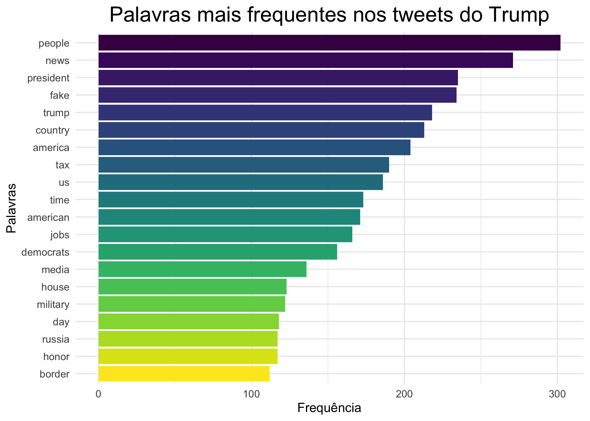
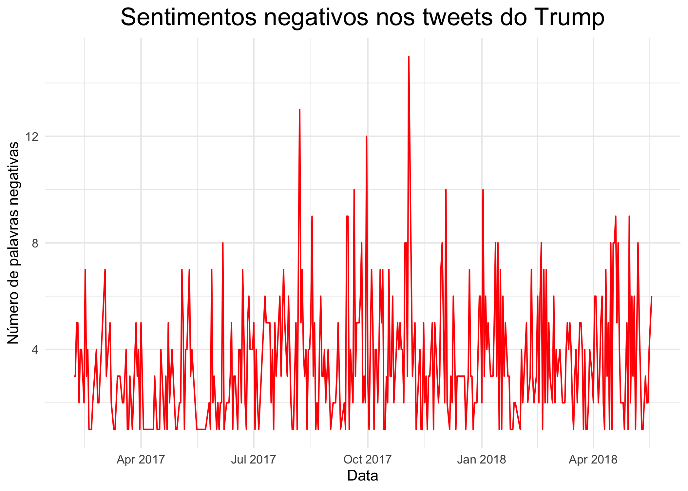

<!-- README.md is generated from README.Rmd. Please edit that file -->

# Day 3: Automated Text Analysis

## Pre-arrival

-   Materiais disponíveis em: <https://sicss.io/curriculum>

### An Introduction to Text Analysis

-   Análise de texto quantitativa; de forma automatizada e usando uma
    grande quantidade de dados.

-   História: registros mais antigos indicam que foi usado para estudar
    propaganda na primeira guerra mundial. Foi similar ao que conhecemos
    como uma análise de conteúdo.

-   Leituras recomendadas:

    -   [ ] [Text as Data: The Promise and Pitfalls of Automatic Content
        Analysis Methods for Political
        Texts](https://www.cambridge.org/core/journals/political-analysis/article/text-as-data-the-promise-and-pitfalls-of-automatic-content-analysis-methods-for-political-texts/F7AAC8B2909441603FEB25C156448F20)

    -   [ ] [Machine Translation: Mining Text for Social
        Theory](https://www.annualreviews.org/doi/abs/10.1146/annurev-soc-081715-074206)

### Text Analysis Basics

-   Encoding dos caracteres: o uso de diferentes encodings muda com o
    tempo, entre os sistemas operacionais, etc. O uso de UTF-8 tem
    crescido!

-   GREP: Globally search a regular expression and print

-   Expressões regulares (Regular expressions, ou RegEx): padrões que
    descrevem um conjunto de strings

``` r
duke_web_scrape <- "Duke Experts: A Trusted Source for Policymakers\n\n\t\t\t\t\t\t"

# verificar se uma palavra está no texto
# R base
grepl("Experts", duke_web_scrape)
#> [1] TRUE
# tidyverse
stringr::str_detect(duke_web_scrape, "Experts")
#> [1] TRUE

# Substituir \t por nada
# R base
gsub("\t", "", duke_web_scrape)
#> [1] "Duke Experts: A Trusted Source for Policymakers\n\n"
# tidyverse
stringr::str_replace_all(duke_web_scrape, "\t", "")
#> [1] "Duke Experts: A Trusted Source for Policymakers\n\n"

# Substituir \t e \n por nada
# R base
gsub("\t|\n", "", duke_web_scrape)
#> [1] "Duke Experts: A Trusted Source for Policymakers"
# tidyverse
stringr::str_replace_all(duke_web_scrape, "\t|\n", "")
#> [1] "Duke Experts: A Trusted Source for Policymakers"
```

-   More GREP!

``` r
library(magrittr, include.only = "%>%")
some_text <- c("Friends", "don't", "let", "friends", "make", "wordclouds")

# buscar todas as palavras que iniciam com
# F maiúsculo
# R Base
some_text[grep("^[F]", some_text)]
#> [1] "Friends"
# tidyverse (é melhor se for trabalhar com dfs)
some_text %>%
  tibble::as_tibble() %>%
  dplyr::filter(stringr::str_detect(value, "^[F]"))
#> # A tibble: 1 x 1
#>   value  
#>   <chr>  
#> 1 Friends
```

-   [Cheat sheet
    RegEx](https://github.com/rstudio/cheatsheets/raw/master/regex.pdf)

-   [Cheat sheet
    stringr](https://evoldyn.gitlab.io/evomics-2018/ref-sheets/R_strings.pdf)

-   Escaping text - com a barra invertida!

``` r
text_chunk <- c("[This Professor is not so Great]")

# não funciona
# gsub("[", "", text_chunk)

# funciona - base R
gsub("\\[|\\]", "", text_chunk)
#> [1] "This Professor is not so Great"

# versão tidyverse
stringr::str_replace_all(text_chunk,"\\[|\\]", "")
#> [1] "This Professor is not so Great"
```

-   **Unidades de análise**: o que vai contar como uma palavra?

-   Tokenization: o mais comum é tokenizar por palavras. Também é
    possível tokenizar por N-grams: sequências de palavras de
    comprimento N. Exemplos:

    -   N = 1 - Unigrams - this, is, a, sentence

    -   N = 2 - Bigrams - this is, is a, a sentence

    -   N = 3 - Trigrams - this is a, is a sentence

-   Criando bases de dados textuais: costumamos trabalhar com um grande
    grupo de documentos (como livros, artigos de jornais, tweets, etc)

``` r
load(url("https://cbail.github.io/Trump_Tweets.Rdata"))

trumptweets$text[1]
#> [1] "Just met with UN Secretary-General António Guterres who is working hard to “Make the United Nations Great Again.” When the UN does more to solve conflicts around the world, it means the U.S. has less to do and we save money. @NikkiHaley is doing a fantastic job! https://t.co/pqUv6cyH2z"
```

-   Criar um “corpus style document”: preservar o conteúdo e os
    metadados.

``` r
# install.packages("tm")

trump_corpus <- tm::Corpus(tm::VectorSource(as.vector(trumptweets$text)))

trump_corpus
```

-   Outra abordagem: tidytext!

``` r
tidy_trump_tweets <- trumptweets %>% 
  dplyr::select(created_at, text) %>% 
  tidytext::unnest_tokens("word", text)

tidy_trump_tweets %>% 
  head() %>% 
  knitr::kable()
```

| created\_at         | word      |
|:--------------------|:----------|
| 2018-05-18 20:41:21 | just      |
| 2018-05-18 20:41:21 | met       |
| 2018-05-18 20:41:21 | with      |
| 2018-05-18 20:41:21 | un        |
| 2018-05-18 20:41:21 | secretary |
| 2018-05-18 20:41:21 | general   |

``` r
tidy_trump_tweets %>% 
  dplyr::count(word, sort = TRUE)
#> # A tibble: 8,690 x 2
#>    word      n
#>    <chr> <int>
#>  1 the    3671
#>  2 to     2216
#>  3 and    1959
#>  4 of     1606
#>  5 https  1281
#>  6 t.co   1258
#>  7 a      1248
#>  8 in     1213
#>  9 is     1045
#> 10 for     886
#> # … with 8,680 more rows
```

-   **Pré-processamento de texto**

-   Stopwords: palavras que não adicionam significado para o texto. É
    comum remover as stopwords das análises.

``` r
tidy_trump_tweets_without_stop_words <- 
  tidy_trump_tweets %>% 
  dplyr::anti_join(tidytext::stop_words) %>% 
  dplyr::filter(!word %in% c("https", "rt", "t.co", "amp"))
#> Joining, by = "word"

tidy_trump_tweets_without_stop_words  %>% 
  dplyr::count(word, sort = TRUE)
#> # A tibble: 8,117 x 2
#>    word          n
#>    <chr>     <int>
#>  1 people      302
#>  2 news        271
#>  3 president   235
#>  4 fake        234
#>  5 trump       218
#>  6 country     213
#>  7 america     204
#>  8 tax         190
#>  9 u.s         186
#> 10 time        173
#> # … with 8,107 more rows
```

-   Limpar o texto: ele mostrou com R Base, estou fazendo com tidyverse

``` r
tidy_trump_tweets_filtered <-
  tidy_trump_tweets_without_stop_words %>% 
  dplyr::mutate(
    # remover números
    # word = tm::removeNumbers(word), # nao esta funcionando no 4.1.0
    word =  gsub("\\d+", "", word),
    
    # substituir vírgula e ponto por nada
    word = stringr::str_replace_all(word, ",|\\.", ""),
    
    # transformar em minusculas
    word = stringr::str_to_lower(word),
    
    # Remover espaços desnecessários
    word = stringr::str_trim(word),
    
    # transformar strings vazias em NA
    word = dplyr::if_else(word == "", NA_character_, word)
    
  ) %>%
  tidyr::drop_na(word)
```

-   Stemização: reduzir cada palavra para sua forma mais básica, para
    fazer a análise

``` r
tidy_trump_tweets_stem <- tidy_trump_tweets_filtered %>%
  dplyr::mutate(word = SnowballC::wordStem(words = word, language = "en"))

tidy_trump_tweets_stem  %>% 
  dplyr::count(word, sort = TRUE)
#> # A tibble: 6,193 x 2
#>    word        n
#>    <chr>   <int>
#>  1 https    1281
#>  2 tco      1258
#>  3 amp       562
#>  4 rt        351
#>  5 peopl     303
#>  6 news      271
#>  7 job       261
#>  8 presid    251
#>  9 countri   247
#> 10 tax       241
#> # … with 6,183 more rows
```

-   Matriz: document-term matrix

``` r
tidy_trump_tweets_stem %>% 
  dplyr::count(created_at, word) %>% 
  tidytext::cast_dtm(created_at, word, n)
```

> Livro [Text Mining with R - A Tidy
> approach](https://www.tidytextmining.com/)

> Livro [Speech and Language
> Processing](https://web.stanford.edu/~jurafsky/slp3/)

### Dictionary-Based Text Analysis

-   Formas sofisticadas de contagem de palavras, associadas com algum
    lexicon (ou grupo de palavras) que contém algum tipo de significado.

``` r
top_words <- tidy_trump_tweets_filtered %>% 
    dplyr::count(word, sort = TRUE)


top_words |>
  dplyr::slice(1:20) |>
  dplyr::mutate(word = forcats::fct_reorder(word, n)) |> 
  ggplot2::ggplot() +
  ggplot2::geom_col(ggplot2::aes(
    x = word,
    y = n,
    fill = word
  )) +
  ggplot2::scale_fill_viridis_d(direction = -1) +
  ggplot2::coord_flip() +
  ggplot2::theme_minimal() +
  ggplot2::guides(fill = FALSE) +
  ggplot2::labs(y = "Frequência", x = "Palavras", title = "Palavras mais frequentes nos tweets do Trump") +
  ggplot2::theme(plot.title = ggplot2::element_text(hjust = 0.5, size = 18))
```



-   Term frequency inverse document frequency (tf-idf) (isso não tá
    claro pra mim ainda)
    -   Inverse document frequency (IDF): Give more weight to a term
        occurring in less documents.
    -   Função `bind_ft_idf()`

``` r
trump_tf_idf <- tidy_trump_tweets_filtered |> 
  dplyr::count(word, created_at) |>
  tidytext::bind_tf_idf(word, created_at, n) |>
  dplyr::arrange(desc(tf_idf))

trump_tf_idf |> head(10) |> knitr::kable()
```

| word              | created\_at         |   n |  tf |      idf |  tf\_idf |
|:------------------|:--------------------|----:|----:|---------:|---------:|
| eqmwvxbim         | 2017-11-15 10:58:18 |   1 |   1 | 8.068090 | 8.068090 |
| hlzrlkif          | 2017-09-22 10:30:06 |   1 |   1 | 8.068090 | 8.068090 |
| tdrycwnc          | 2017-11-12 14:29:22 |   1 |   1 | 8.068090 | 8.068090 |
| umyjluid          | 2018-03-30 20:24:56 |   1 |   1 | 8.068090 | 8.068090 |
| vlqyalcto         | 2018-04-14 01:31:56 |   1 |   1 | 8.068090 | 8.068090 |
| vsmnwxtei         | 2017-09-17 11:57:20 |   1 |   1 | 8.068090 | 8.068090 |
| ymuqsvvtsb        | 2017-10-05 10:46:02 |   1 |   1 | 8.068090 | 8.068090 |
| yqxoaufd          | 2018-03-06 13:05:34 |   1 |   1 | 8.068090 | 8.068090 |
| standforouranthem | 2017-09-25 13:02:27 |   1 |   1 | 6.969477 | 6.969477 |
| karen             | 2017-06-21 02:21:36 |   1 |   1 | 6.122179 | 6.122179 |

Criando um dicionário relacionado a um tema. Ex:

``` r
economic_dictionary <- c("economy", "unemployment", "trade", "tariffs")

economic_tweets <- trumptweets |> 
  dplyr::filter(stringr::str_detect(string = text, pattern =  economic_dictionary))

head(economic_tweets$text, 2)
#> [1] "Great talk with my friend President Mauricio Macri of Argentina this week. He is doing such a good job for Argentina. I support his vision for transforming his country’s economy and unleashing its potential!"                                                         
#> [2] "The Washington Post and CNN have typically written false stories about our trade negotiations with China. Nothing has happened with ZTE except as it pertains to the larger trade deal. Our country has been losing hundreds of billions of dollars a year with China..."
```

-   Análise de sentimento: porcentagem de palavras negativas e
    positivas.

``` r
head(tidytext::get_sentiments(lexicon = "bing"))
#> # A tibble: 6 x 2
#>   word       sentiment
#>   <chr>      <chr>    
#> 1 2-faces    negative 
#> 2 abnormal   negative 
#> 3 abolish    negative 
#> 4 abominable negative 
#> 5 abominably negative 
#> 6 abominate  negative
```

``` r
trump_tweet_sentiment <- tidy_trump_tweets_filtered |> 
  dplyr::inner_join(tidytext::get_sentiments(lexicon = "bing")) |> 
  dplyr::count(created_at, sentiment)
#> Joining, by = "word"

head(trump_tweet_sentiment)
#> # A tibble: 6 x 3
#>   created_at          sentiment     n
#>   <dttm>              <chr>     <int>
#> 1 2017-02-05 22:49:42 positive      1
#> 2 2017-02-06 03:36:54 positive      4
#> 3 2017-02-06 12:01:53 negative      2
#> 4 2017-02-06 12:07:55 negative      2
#> 5 2017-02-06 16:32:24 negative      3
#> 6 2017-02-06 23:33:52 positive      2
```

``` r
trump_tweet_sentiment |> 
  dplyr::mutate(date = lubridate::floor_date(created_at, "day"))   |> 
  dplyr::filter(sentiment == "negative") |> 
  dplyr::count(date, sentiment) |> 
  ggplot2::ggplot() +
  ggplot2::geom_line(ggplot2::aes(x = date, y = n), color = "red", size = 0.5) +
  ggplot2::theme_minimal() + 
  ggplot2::labs(x = "Data", y = "Número de palavras negativas", title = "Sentimentos negativos nos tweets do Trump") +
  ggplot2::theme(plot.title = ggplot2::element_text(hjust = 0.5, size = 18))
```



-   Quem decide o que é uma palavra negativa ou positiva? Quem criou o
    dicionário!

-   Coisas como sarcasmo, ironia: são difíceis de detectar nesse tipo de
    análise.

-   Quando escolher um dicionário, escolher algo que tenha entendimentos
    similares ao meu. Diferentes dicionários tem melhores performances
    em diferentes contextos.

-   B: Em português, conheço esse pacote de análise de sentimentos:

``` r
# devtools::install_github("sillasgonzaga/lexiconPT")
library(lexiconPT)
# carregando os dicionários
data("sentiLex_lem_PT02")
data("oplexicon_v2.1")
data("oplexicon_v3.0")

lexiconPT::get_word_sentiment("temer")
#> $oplexicon_v2.1
#>        term type polarity
#> 28711 temer   vb        1
#> 
#> $oplexicon_v3.0
#>        term type polarity polarity_revision
#> 30160 temer   vb        1                 A
#> 
#> $sentilex
#>       term grammar_category polarity polarity_target polarity_classification
#> 6546 temer                V       -1           N0:N1                     MAN

lexiconPT::get_word_sentiment("bolsonaro")
#> $oplexicon_v2.1
#> [1] "Word not present in dataset"
#> 
#> $oplexicon_v3.0
#> [1] "Word not present in dataset"
#> 
#> $sentilex
#> [1] "Word not present in dataset"
```

-   Linguistic inquiry word count (LIWC) - é popular, mas imperfeito.

-   Quando usar dictionary-based analises? depende! Se sabemos
    concretamente o que vamos procurar nos dados, e temos uma lista de
    palavras, pode ser uma boa idea. Se não, podemos usar os métodos não
    supervisionados. Também é possível fazer com métodos híbridos :)

### Topic Models

### Text Networks

``` r
sessioninfo::session_info()$platform
#>  setting  value                                 
#>  version  R version 4.1.0 RC (2021-05-17 r80314)
#>  os       macOS Big Sur 11.2.3                  
#>  system   aarch64, darwin20                     
#>  ui       X11                                   
#>  language (EN)                                  
#>  collate  en_US.UTF-8                           
#>  ctype    en_US.UTF-8                           
#>  tz       America/Sao_Paulo                     
#>  date     2021-05-19
```
